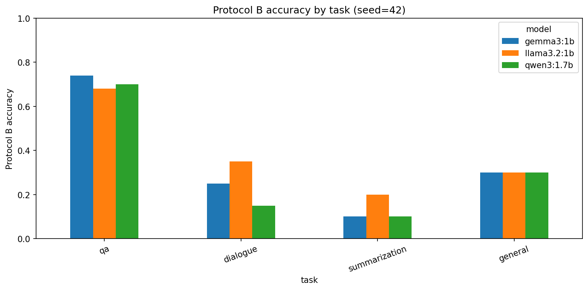
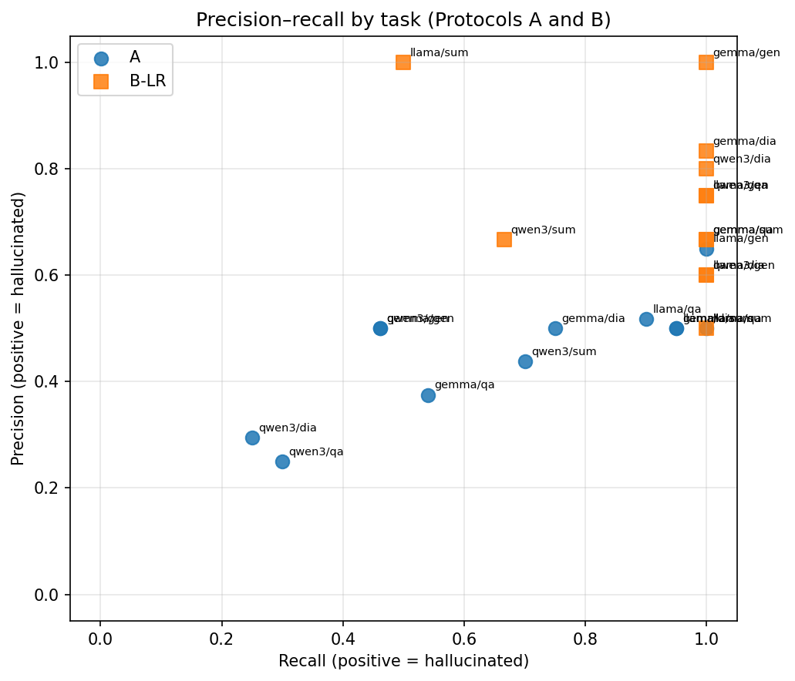

# Hallucination Discrimination versus Free-Generation Evaluation in Small Open-Source Language Models

**Authors:** Sushmita Hari · Connor Fahs · William McDonald · Sriram Rella

**Course Project Final Report**


# Introduction

Hallucinations, fluent but fabricated or ungrounded claims, remain a
central obstacle to deploying language models in settings where factual
reliability matters. A model that invents a citation, attributes a
quotation to the wrong speaker, or summarizes a document with an event
that never appears in the source can look competent while being wrong in
ways that are costly to detect after the fact. Much of the public
discussion of this problem focuses on frontier-scale systems with
proprietary interfaces. Yet the models that many practitioners can
actually run locally for chat, summarization, tutoring, and
retrieval-augmented workflows are often in the one- to
two-billion-parameter range. These compact open-source models are
attractive precisely because they are cheap, inspectable, and deployable
without sending user text to a remote API. That same deployment path
makes their failure modes consequential: if a one-billion-parameter
model cannot tell a supported answer from a fabricated one when both are
placed in front of it, then any downstream filter that asks the model to
“check itself” is unreliable by construction. If, on the other hand, the
same model sometimes generates text that overlaps a gold reference more
than a known hallucinated foil, that is evidence of a different
capability (generation under a lexical faithfulness proxy), and
conflating the two produces misleading claims about a single
“hallucination rate.”

The evaluation literature already contains several ways to measure
related phenomena. Benchmarks such as HaluEval provide paired faithful
and hallucinated responses. TruthfulQA probes whether models reproduce
human-like falsehoods. SelfCheckGPT estimates hallucination risk from
disagreement among multiple samples without a gold reference.
LLM-as-judge pipelines outsource grading to a stronger model. What
remains under-specified for the small open-source regime is a careful
separation between *discrimination* (given one candidate, is it
hallucinated?) and *free generation* (write an answer, then score it against faithful and hallucinated references with an explicit rule).
Those two questions induce different prediction problems, different
label distributions, and different incentives for response bias.
Treating either one as the sole headline number for “how much a small
model hallucinates” obscures whether observed errors come from an
inability to generate grounded text, an inability to judge candidates,
or a trivial policy such as always answering Yes.

This report therefore separates those capabilities explicitly and
measures both on the same HaluEval task families: question answering,
dialogue response, summarization, and general user queries. We evaluate
three small open-source models, Llama 3.2 1B, Qwen3 1.7B, and
Gemma 3 1B, under two protocols. Protocol A is paired discrimination:
given context and one candidate answer that is either the dataset’s
faithful reference or its hallucinated counterpart, the model answers
Yes or No to whether the candidate is hallucinated. Protocol B is free
generation: the model writes an answer from the same context, we score
that answer with a task-aware word-overlap rule against the faithful and
hallucinated references, and we then train logistic regression and a
small neural network on the resulting overlap features to detect whether
the generation was labeled incorrect. Empirically, Protocol A overall
accuracies are 0.530 (Llama), 0.280 (Qwen), and 0.395 (Gemma) on 200
judgements each; Protocol B free-generation accuracies are 0.464, 0.418,
and 0.455 respectively on 110 items each. F1 on Protocol A is a poor
standalone summary because Llama’s 0.674 F1 coexists with a 0.925 rate
of predicting “hallucinated,” while QA accuracy rises under Protocol B
(0.68–0.74) even as discrimination on QA remains weak. Our contribution
is a reproducible, side-by-side formalization and measurement of
discrimination versus free-generation evaluation for small open-source
LLMs on HaluEval, showing that the two protocols estimate different
model functionals and that task difficulty systematically reverses
between them. We deliberately do not designate a single protocol as the
headline leaderboard score; the scientific claim is the complementarity
and the reversal, not a one-number ranking of the three models.

# Related Work

HaluEval  supplies paired faithful and hallucinated responses across QA,
dialogue, summarization, and general user queries, and is the primary
data source for our experiments. The original benchmark emphasizes
large-scale evaluation of hallucination phenomena and includes settings
in which models are asked to identify hallucinations. Our Protocol A
reuses that pairing, but differs from simply reporting a HaluEval
leaderboard aggregate in three respects. First, we restrict attention to
small open-source models that can be run locally, because that is the
deployment regime motivating the project. Second, we treat the model
under test itself as the Yes/No discriminator rather than relying on a
larger external judge for the primary Protocol A metric. Third, we
retain full confusion matrices, predicted-positive rates, and per-task
breakdowns so that response bias is visible rather than collapsed into a
single F1. In that sense we build on HaluEval’s data contribution while
changing the inferential target from “how often do large models
hallucinate on this benchmark” to “can these particular small models
discriminate HaluEval’s own pairs, and how does that relate to their
free generations on the same items.”

TruthfulQA  probes whether models imitate human falsehoods on
adversarially curated questions about the world. Its central concern is
truthfulness relative to consensual reality, often without a document
that the answer must be faithful to. That design is complementary to
ours but not interchangeable. TruthfulQA does not present an explicit
hallucinated foil beside a gold answer for binary discrimination on each
item, and it does not score a unique free generation against a paired
hallucinated reference with a deterministic overlap decision rule. Our
Protocol A is closer to a forced-choice faithfulness test conditioned on
HaluEval candidates and contexts. Protocol B occupies the
generation-and-compare niche that TruthfulQA does not formalize with a
hallucinated twin: the model must produce text, after which a fixed
lexical rule decides whether that text is closer to the faithful or the
hallucinated reference. A model could in principle do well on
TruthfulQA-style world-knowledge probes while still failing Protocol A
discrimination on document-grounded candidates, or the reverse; our
experiments are designed to measure the latter family of failures
directly.

Work on factuality and faithfulness  distinguishes errors relative to
world knowledge from errors relative to a provided source. Summarization
and knowledge-grounded dialogue research has long argued that a summary
can be factually true in the world yet unfaithful to the input document,
or faithful to the document yet incomplete. HaluEval’s
knowledge-conditioned tasks sit primarily in the faithfulness regime:
the hallucination is defined relative to supplied knowledge, dialogue
history, or document text. Our discrimination prompt asks whether the
candidate is fabricated or unsupported by the given context, aligning
Protocol A with faithfulness rather than open-world factuality.
Protocol B’s overlap rule is likewise a faithfulness proxy, not a
fact-checking system against the web. That alignment matters for
interpretation. When Llama marks a faithful QA candidate as
hallucinated, the error is a faithfulness-discrimination failure under
HaluEval labels, not necessarily a claim that the string is false in the
world.

SelfCheckGPT  estimates hallucination risk by sampling multiple
generations and measuring inconsistency among them, without requiring a
gold answer. That approach addresses an important reference-free setting
in which no trusted $`r^+`$ exists. It does not ask a model to classify
a single provided candidate, and it does not compare one free generation
to a dataset-supplied hallucinated string via deterministic overlap.
Protocol A is therefore complementary: one candidate, one binary
decision, supervised labels from HaluEval. Protocol B is complementary
in a different way: a single generation is scored against fixed
references rather than against the model’s own resampled variants.
SelfCheckGPT would be a natural third protocol in future work; it is not
a substitute for either protocol here, because it answers a different
statistical question (sample inconsistency) than discrimination risk or
overlap-relative generation accuracy.

LLM-as-judge evaluations  use a strong model to grade outputs, often
with detailed rubrics and pairwise preferences. Those pipelines are
powerful when the scientific goal is scalable approximation to human
preference. They are the wrong primary instrument when the scientific
goal is to characterize the small model’s own discrimination ability. We
deliberately avoid outsourcing Protocol A labels to a larger judge. The
object of study is whether Llama, Qwen, or Gemma can discriminate. Where
LLM-as-judge papers measure agreement with humans, we measure the small
model’s agreement with HaluEval’s pre-labeled candidates. Protocol B
goes further and removes the LLM judge entirely for the generation
score, replacing it with an explicit overlap rule and, for secondary
analysis, classical classifiers trained on those overlaps. In summary,
HaluEval gives us the pairs, TruthfulQA motivates truthfulness
evaluation without our paired Yes/No setup, the factuality/faithfulness
taxonomy situates our context-grounded prompt, SelfCheckGPT covers
reference-free multi-sample detection that neither of our protocols
implements, and LLM-as-judge work motivates external grading that we
intentionally replace with the model under test (Protocol A) or with a
deterministic overlap rule and classical classifiers (Protocol B).

# Methods

Let
$`\mathcal{T}=\{\mathrm{qa},\mathrm{dialogue},\mathrm{summarization},\mathrm{general}\}`$
index HaluEval tasks. For each task $`t\in\mathcal{T}`$ we draw a fixed
random subset of items with seed $`42`$, yielding $`n_{\mathrm{qa}}=50`$
and $`n_t=20`$ for the other three tasks, hence $`n=110`$ items total
per model. Each item $`i`$ provides a context $`c_i`$ (possibly empty
for general queries), a prompt stem $`q_i`$, a faithful reference
$`r_i^+`$, and a hallucinated reference $`r_i^-`$. For general items,
only one of $`r_i^+`$ or $`r_i^-`$ is nonempty according to the
dataset’s hallucination label, so Protocol A contributes one judgement
rather than two for those rows. The models under test are
$`m\in\{\texttt{llama3.2:1b},\texttt{qwen3:1.7b},\texttt{gemma3:1b}\}`$,
queried locally through Ollama with short generations and low
temperature for discrimination. For Qwen3 we disable thinking mode at
the API level ($`\mathtt{think{=}false}`$) so that completions occupy
the content channel rather than exhausting the token budget on hidden
reasoning; without that setting, Qwen3 can return empty `content` fields
and produce vacuous Protocol A/B scores that reflect an interface
mismatch rather than discrimination or generation ability.

#### Protocol A (paired discrimination).

For every item with a nonempty faithful reference we form a judgement
instance $`(c_i,q_i,r_i^+,y=0)`$, and for every nonempty hallucinated
reference $`(c_i,q_i,r_i^-,y=1)`$, where $`y=1`$ denotes “hallucinated.”
This produces $`N_A=200`$ labelled judgements per model in our run. The
model implements a predictor $`\hat y=f_m(c,q,r)\in\{0,1\}`$ by
answering a Yes/No prompt that asks whether the candidate is a
hallucination fabricated or unsupported by the context. We parse the
completion by normalizing punctuation and reading the leading Yes/No
token, with a conservative fallback that searches for an unambiguous Yes
or No elsewhere in the string. With positive class $`y=1`$,
``` math
\begin{align*}
\mathrm{TP}&=\sum\mathbf{1}[\hat y=1,y=1],&
\mathrm{FP}&=\sum\mathbf{1}[\hat y=1,y=0],\\
\mathrm{TN}&=\sum\mathbf{1}[\hat y=0,y=0],&
\mathrm{FN}&=\sum\mathbf{1}[\hat y=0,y=1],
\end{align*}
```
and we report
``` math
\begin{align*}
\mathrm{Acc}&=\frac{\mathrm{TP}+\mathrm{TN}}{N},&
\mathrm{Prec}&=\frac{\mathrm{TP}}{\mathrm{TP}+\mathrm{FP}},&
\mathrm{Rec}&=\frac{\mathrm{TP}}{\mathrm{TP}+\mathrm{FN}},\\
F_1&=2\cdot\frac{\mathrm{Prec}\cdot\mathrm{Rec}}{\mathrm{Prec}+\mathrm{Rec}},
\end{align*}
```
with zero-division defined as zero. We additionally report the predicted
positive rate $`\widehat{\pi}=\frac{1}{N}\sum\hat y`$ because, when
labels are near-balanced, a trivial always-Yes policy can inflate recall
and F1 without demonstrating discrimination. Protocol A therefore
estimates the risk $`\mathbb{E}[\mathbf{1}[f_m(C,Q,R)\neq Y]]`$ under
the HaluEval candidate distribution: a supervised discrimination
functional of $`f_m`$.

#### Protocol B (free generation and overlap scoring).

The same items are presented without a candidate answer. Let
$`a_i=g_m(c_i,q_i)`$ be the model’s free generation under a
task-specific prompt (short answer for QA, next dialogue turn,
two-to-three-sentence summary, or short general reply). Define a
normalization map that lowercases and strips punctuation, and let
$`T(u)`$ be the resulting token set. Jaccard overlap is
``` math
\mathrm{ov}(u,v)=\begin{cases}
\dfrac{|T(u)\cap T(v)|}{|T(u)\cup T(v)|} & \text{if }T(u),T(v)\neq\emptyset,\\
0 & \text{otherwise.}
\end{cases}
```
Correctness $`\mathrm{corr}_i\in\{0,1\}`$ is task-dependent. For QA,
$`\mathrm{corr}_i=1`$ if the normalized faithful string is a substring
of the normalized answer or its token set is contained in the answer’s
token set; otherwise we fall through to the overlap rule used for other
tasks:
``` math
\mathrm{corr}_i=\mathbf{1}\!\left[\mathrm{ov}(a_i,r_i^+)>\mathrm{ov}(a_i,r_i^-)\right]
```
when $`r_i^+`$ is nonempty. Protocol B generation accuracy is
$`\frac{1}{n}\sum_i\mathrm{corr}_i`$. This estimates a different
functional: performance of the generator $`g_m`$ under a deterministic
reference comparison, not the discrimination risk of $`f_m`$. The QA
substring rule is intentionally lenient to short entity answers; the
overlap rule for longer outputs is stricter in requiring the generation
to be lexically closer to the faithful reference than to the
hallucinated foil.

#### Overlap-feature classifiers.

On Protocol B outputs we form features
$`x_i=\bigl(\mathrm{ov}(a_i,r_i^+),\mathrm{ov}(a_i,r_i^-)\bigr)`$ and
labels $`z_i=1-\mathrm{corr}_i`$ (positive $`=`$ generation judged
hallucinated/incorrect). A stratified $`75/25`$ split with the same seed
trains $`\ell_2`$-regularized logistic regression with grid search over
$`C\in\{0.1,1,10\}`$ and a one-hidden- layer network with eight ReLU
units and a sigmoid output trained with binary cross-entropy. Classifier
accuracy is measured on the held-out $`z`$ labels. That quantity is a
post-hoc detectability score in a two-dimensional feature space, not a
claim that the classifier “answers the user question better” than the
LLM. We also report precision, recall, and $`F_1`$ for these detectors
with the same positive-class convention as Protocol A, and we store
per-item predicted probabilities for later AUC analysis.

#### Relationship between protocols.

We do not standardize on a single protocol for headline ranking. Let
$`R_A(m,t)`$ be Protocol A accuracy and $`R_B(m,t)`$ Protocol B accuracy
on task $`t`$. Because $`f_m`$ and $`g_m`$ are distinct maps, and
because the sampling measures differ (candidate judgement versus free
generation), $`R_A`$ and $`R_B`$ are not estimators of a common
parameter $`\theta(m)`$. Any scalar that averages them would mix
incompatible estimands. We therefore report both as complementary
evaluations and, separately, the signed gap
$`\Delta(m,t)=R_A(m,t)-R_B(m,t)`$ only as evidence of task-difficulty
reversal. A negative $`\Delta`$ means free-generation accuracy exceeds
discrimination accuracy on that task; it does not mean the model is
“better” in an absolute sense. A joint key $`(t,i,m)`$ stores both views
when present; missing cells are left missing rather than imputed, so
coverage is an explicit part of the experimental record.

# Experiments and Results

All numbers below come from the committed result CSVs under `results/`
for the shared 110-item sample (Protocol B) and 200 judgements per model
(Protocol A). Protocol B was executed for all three models. No larger
Protocol A artefact (for example a 9,000-judgement midway Table 1) is
present in the project repository, so every quantitative claim in this
section is taken from that reproducible local run rather than from an
external or missing table.

## Protocol A: discrimination

Table <a href="#tab:protocol-a" data-reference-type="ref"
data-reference="tab:protocol-a">1</a> summarizes overall discrimination
metrics. Llama attains the highest accuracy (0.530) and $`F_1`$ (0.674),
Qwen the lowest (0.280 accuracy, 0.357 $`F_1`$), and Gemma sits between
them (0.395 / 0.525). These $`F_1`$ values are misleading if read as a
ranking of discrimination skill. Llama predicts the positive
(hallucinated) class on 185 of 200 judgements (rate 0.925), yielding
recall 0.942 but precision only 0.524. The confusion matrix contains
only nine true negatives and six false negatives: the model almost never
says No. On a near-balanced label distribution (gold positive rate
0.515), a constant-Yes classifier already achieves high recall and
middling precision, so Llama’s $`F_1`$ largely reflects response bias
rather than calibrated discrimination. Gemma also skews positive
(predicted Yes rate 0.760) with recall 0.650 and precision 0.441. Qwen’s
predicted Yes rate (0.605) is closer to the base rate, yet accuracy
falls to 0.280 with precision 0.331 and recall 0.388, indicating weak
separation rather than a simple always-Yes policy. In that sense, none
of the three models shows strong genuine discrimination on this sample.
Llama exhibits the clearest fixed-bias artifact; Qwen fails with more
balanced predictions; Gemma mixes moderate bias with moderate error.

<div id="tab:protocol-a">

| Model        | Acc.  | Prec. | Rec.  | $`F_1`$ | TP/FP/TN/FN | Pred. Yes |
|:-------------|:-----:|:-----:|:-----:|:-------:|:-----------:|:---------:|
| Llama 3.2 1B | 0.530 | 0.524 | 0.942 |  0.674  |  97/88/9/6  |   0.925   |
| Qwen3 1.7B   | 0.280 | 0.331 | 0.388 |  0.357  | 40/81/16/63 |   0.605   |
| Gemma 3 1B   | 0.395 | 0.441 | 0.650 |  0.525  | 67/85/12/36 |   0.760   |

Protocol A overall metrics (positive class $`=`$ hallucinated; $`N=200`$
judgements per model). Source: `protocol_a_metrics_*.csv` and run CSVs.

</div>

Qualitatively, Llama’s false positives include faithful QA candidates
such as the gold entity “Badr Hari,” which the model nonetheless labels
Yes, while one of its scarce true negatives is the faithful candidate
“Dessau,” labeled No. The coexistence of both outcomes shows that the
bias is strong but not literally constant; it is still far from useful
discrimination. Per-task Protocol A accuracies
(Table <a href="#tab:protocol-a-task" data-reference-type="ref"
data-reference="tab:protocol-a-task">2</a>) show that general queries
are relatively easier for Llama (0.65), while QA is hardest for Qwen
(0.20) and Gemma (0.32). Summarization and dialogue hover near 0.50 for
Llama and Gemma, consistent with near-chance behavior once class balance
is considered.

<div id="tab:protocol-a-task">

| Model        |  QA  | Dialogue | Summarization | General |
|:-------------|:----:|:--------:|:-------------:|:-------:|
| Llama 3.2 1B | 0.53 |   0.50   |     0.50      |  0.65   |
| Qwen3 1.7B   | 0.20 |  0.325   |     0.40      |  0.35   |
| Gemma 3 1B   | 0.32 |   0.50   |     0.50      |  0.35   |

Protocol A accuracy by task. Source: `protocol_a_metrics_*.csv`.

</div>

## Protocol B: free generation and classifiers

Table <a href="#tab:protocol-b" data-reference-type="ref"
data-reference="tab:protocol-b">3</a> reports free-generation accuracy
under the overlap rule. Overall accuracies are 0.464 (Llama), 0.418
(Qwen), and 0.455 (Gemma). QA dominates: 0.68, 0.70, and 0.74
respectively, whereas summarization falls to 0.20, 0.10, and 0.10.
Dialogue ranges from 0.15 (Qwen) to 0.35 (Llama); general is uniformly
0.30. For Llama, incorrect generations distribute across tasks as 16 QA
errors, 13 dialogue errors, 14 general errors, and 16 summarization
errors, so the overall 0.464 figure is not driven by a single collapsed
task. Qualitatively, short QA answers often contain the gold entity
under the substring rule (Gemma, for example, answers “Dessau” on a
Hotpot-style item where that is the faithful span), while long summaries
frequently lose to the hallucinated foil on Jaccard overlap. In one
Llama summarization failure, the generation’s overlap with the faithful
summary is 0.247 versus 0.317 with the hallucinated summary, so the
decision rule marks the output incorrect even though the generation
discusses the same news event; lexical proximity to the foil is enough
to flip the label. That pattern explains why summarization looks
catastrophically hard under Protocol B without implying that the model
produced unrelated text.

<div id="tab:protocol-b">

| Model        |  QA  | Dialogue | Summ. | General | Overall |
|:-------------|:----:|:--------:|:-----:|:-------:|:-------:|
| Llama 3.2 1B | 0.68 |   0.35   | 0.20  |  0.30   |  0.464  |
| Qwen3 1.7B   | 0.70 |   0.15   | 0.10  |  0.30   |  0.418  |
| Gemma 3 1B   | 0.74 |   0.25   | 0.10  |  0.30   |  0.455  |

Protocol B free-generation accuracy by task ($`n=110`$ items per model).
Source: `task_metrics_*.csv`.

</div>

Held-out overlap-classifier accuracies
(Table <a href="#tab:clf" data-reference-type="ref"
data-reference="tab:clf">4</a>) substantially exceed free-generation
accuracy for every model: logistic regression reaches 0.643 / 0.750 /
0.857 and the neural net 0.679 / 0.821 / 0.857 for Llama, Qwen, and
Gemma respectively, versus direct accuracies 0.464 / 0.418 / 0.455. The
correct interpretation is not that classifiers answer user questions
better, but that the two-dimensional overlap feature
$`(\mathrm{ov}(a,r^+),\mathrm{ov}(a,r^-))`$ separates Protocol B’s own
correctness labels more cleanly than the generator matches $`r^+`$. On
the same held-out splits ($`n=28`$), detector $`F_1`$ for logistic
regression is 0.722 (Llama), 0.811 (Qwen), and 0.882 (Gemma). Relative
to direct generation accuracy, the absolute lifts are approximately
$`+0.179`$ (Llama LR), $`+0.332`$ (Qwen LR), and $`+0.402`$ (Gemma LR).
These lifts shrink the claim one should make: overlap features are
informative about the scoring rule’s own errors; they do not
rehabilitate the generator.

<div id="tab:clf">

| Model        | Direct acc. | LR acc. | NN acc. |
|:-------------|:-----------:|:-------:|:-------:|
| Llama 3.2 1B |    0.464    |  0.643  |  0.679  |
| Qwen3 1.7B   |    0.418    |  0.750  |  0.821  |
| Gemma 3 1B   |    0.455    |  0.857  |  0.857  |

Protocol B direct generation accuracy versus held-out overlap-classifier
accuracy ($`n=110`$ pool; test size $`28`$). Source:
`model_accuracy_all_models.csv`.

</div>

## Task-difficulty reversal between protocols

Table <a href="#tab:delta" data-reference-type="ref"
data-reference="tab:delta">5</a> reports $`\Delta=R_A-R_B`$ by task. For
every model, QA shows a negative gap (Protocol B higher): $`-0.15`$
(Llama), $`-0.50`$ (Qwen), $`-0.42`$ (Gemma). Non-QA tasks are positive:
discrimination accuracy exceeds free-generation accuracy on dialogue,
summarization, and usually general. Thus task difficulty reverses. QA is
the easiest free-generation task in
Table <a href="#tab:protocol-b" data-reference-type="ref"
data-reference="tab:protocol-b">3</a> and among the hardest
discrimination tasks in
Table <a href="#tab:protocol-a-task" data-reference-type="ref"
data-reference="tab:protocol-a-task">2</a>. Summarization is near chance
under Protocol A for Llama and Gemma (0.50) but near floor under
Protocol B (0.10–0.20).
Figure <a href="#fig:task" data-reference-type="ref"
data-reference="fig:task">1</a> visualizes Protocol B accuracies;
Figure <a href="#fig:pr" data-reference-type="ref"
data-reference="fig:pr">2</a> places Protocol A and Protocol B
logistic-regression operating points in precision–recall space. We treat
this reversal as evidence that a single hallucination leaderboard mixing
judgement and generation would scramble both model comparisons and task
comparisons.

<div id="tab:delta">

| Model        | Task          | $`R_A`$ | $`R_B`$ | $`\Delta`$ (flip?) |
|:-------------|:--------------|:-------:|:-------:|:------------------:|
| Llama 3.2 1B | QA            |  0.53   |  0.68   |  $`-0.15`$ (yes)   |
| Llama 3.2 1B | Dialogue      |  0.50   |  0.35   |     $`+0.15`$      |
| Llama 3.2 1B | Summarization |  0.50   |  0.20   |     $`+0.30`$      |
| Llama 3.2 1B | General       |  0.65   |  0.30   |     $`+0.35`$      |
| Qwen3 1.7B   | QA            |  0.20   |  0.70   |  $`-0.50`$ (yes)   |
| Qwen3 1.7B   | Dialogue      |  0.325  |  0.15   |     $`+0.175`$     |
| Qwen3 1.7B   | Summarization |  0.40   |  0.10   |     $`+0.30`$      |
| Qwen3 1.7B   | General       |  0.35   |  0.30   |     $`+0.05`$      |
| Gemma 3 1B   | QA            |  0.32   |  0.74   |  $`-0.42`$ (yes)   |
| Gemma 3 1B   | Dialogue      |  0.50   |  0.25   |     $`+0.25`$      |
| Gemma 3 1B   | Summarization |  0.50   |  0.10   |     $`+0.40`$      |
| Gemma 3 1B   | General       |  0.35   |  0.30   |     $`+0.05`$      |

Protocol A minus Protocol B accuracy ($`\Delta`$). Sign flip marks
$`\Delta<0`$ (B exceeds A). Source: `protocol_comparison.csv`.

</div>

<figure id="fig:task" data-latex-placement="t">

<figcaption>Protocol B free-generation accuracy by task and model (seed
42). Values: Llama QA 0.680, dialogue 0.350, summarization 0.200,
general 0.300; Qwen 0.700 / 0.150 / 0.100 / 0.300; Gemma 0.740 / 0.250 /
0.100 / 0.300.</figcaption>
</figure>

<figure id="fig:pr" data-latex-placement="t">

<figcaption>Precision–recall scatter for Protocol A (circles) and
Protocol B logistic regression on the held-out split (squares); positive
class <span class="math inline">=</span> hallucinated. Supporting
per-point precision/recall/F1 appear in
<code>results/figure_captions.md</code>.</figcaption>
</figure>

# Conclusion

We built and ran a reproducible dual-protocol evaluation of
hallucination behavior in three small open-source LLMs on HaluEval.
Protocol A asks each model to discriminate faithful from hallucinated
candidates; Protocol B asks each model to generate freely, scores those
generations with a fixed overlap rule, and trains classical detectors on
overlap features. The experimental design refuses a single headline
protocol: discrimination risk and generation-under- overlap are
different functionals, and the signed gap $`\Delta`$ is used only to
expose task-difficulty reversal.

What a reader now knows, concretely, is the following comparative
picture. On this sample, discrimination accuracies are only 0.530,
0.280, and 0.395 for Llama, Qwen, and Gemma. Llama’s 0.674 $`F_1`$ is
largely a Yes-bias artifact, with a 0.925 positive prediction rate and
only nine true negatives out of 200 judgements. Free-generation overall
accuracies are 0.464, 0.418, and 0.455, with QA much easier (0.68–0.74)
than summarization (0.10–0.20). QA is the unique task where Protocol B
accuracy exceeds Protocol A for all three models, with gaps as large as
$`-0.50`$ for Qwen. Overlap-feature classifiers detect Protocol B error
labels at held-out accuracies 0.64–0.86, well above generation accuracy,
showing that post-hoc feature separation is easier than faithful
generation under our rule. None of those statements is available from
Protocol A alone or Protocol B alone.

Relative to the literature reviewed above, this contribution is not a
new benchmark dataset and not a reference-free SelfCheck-style sampler.
It is a methodological insistence that paired discrimination and
free-generation-plus- overlap estimate different functionals of the same
small models, reported jointly without collapsing to one score. That
stance extends HaluEval-style evaluation by making the small model the
discriminator and by insisting on bias-aware reading of F1. It extends
truthfulness-style work by adding an explicit hallucinated foil and a
second generation protocol tied to the same items. It complements
LLM-as-judge pipelines by refusing to outsource Protocol A labels to a
larger model and by using a deterministic overlap rule for Protocol B
generation scoring.

Several limitations bound these claims. The present reproducible run
uses 110 Protocol B items and 200 Protocol A judgements per model rather
than a full HaluEval sweep; classifier test sets contain only 28 points;
and overlap scoring is a lexical proxy for faithfulness, not human
judgment. Qwen3 required an explicit $`\mathtt{think{=}false}`$ setting
to yield nonempty completions, which is an engineering detail with
scientific consequences for anyone repeating the study. Because the
repository contains no larger Protocol A table, we do not cite a
separate midway judgement count alongside these numbers. Future work
should vary discrimination prompts systematically to test how sensitive
the Yes-bias finding is to wording and to decoding temperature, evaluate
a second dataset beyond HaluEval to check whether the QA difficulty
reversal replicates outside this benchmark’s construction, and construct
a small synthetic ground-truth validation set in which faithfulness is
unambiguous by design so that overlap-rule errors can be separated from
model errors. Richer Protocol B features, such as length ratios or
entailment scores, could be added while keeping the same non-imputation
rule for missing cells. Extending both protocols under identical
sampling to larger open models would clarify whether the
bias-versus-discrimination pattern is specific to the sub-2B regime
studied here or persists as capacity increases.

<div class="thebibliography">

9

Junyi Li, Xiaoxue Cheng, Wayne Xin Zhao, Jian-Yun Nie, and Ji-Rong Wen.
HaluEval: A Large-Scale Hallucination Evaluation Benchmark for Large
Language Models. In *Proceedings of the 2023 Conference on Empirical
Methods in Natural Language Processing*, pages 6449–6464, Singapore,
2023. Association for Computational Linguistics.

Stephanie Lin, Jacob Hilton, and Owain Evans. TruthfulQA: Measuring How
Models Mimic Human Falsehoods. In *Proceedings of the 60th Annual
Meeting of the Association for Computational Linguistics (Volume 1: Long
Papers)*, pages 3214–3252, Dublin, Ireland, 2022. Association for
Computational Linguistics.

Joshua Maynez, Shashi Narayan, Bernd Bohnet, and Ryan McDonald. On
Faithfulness and Factuality in Abstractive Summarization. In
*Proceedings of the 58th Annual Meeting of the Association for
Computational Linguistics*, pages 1906–1919, 2020. Association for
Computational Linguistics.

Potsawee Manakul, Adian Liusie, and Mark Gales. SelfCheckGPT:
Zero-Resource Black-Box Hallucination Detection for Generative Large
Language Models. In *Proceedings of the 2023 Conference on Empirical
Methods in Natural Language Processing*, pages 9004–9017, Singapore,
2023. Association for Computational Linguistics.

Lianmin Zheng, Wei-Lin Chiang, Ying Sheng, Siyuan Zhuang, Zhanghao Wu,
Yonghao Zhuang, Zi Lin, Zhuohan Li, Dacheng Li, Eric Xing, Hao Zhang,
Joseph E. Gonzalez, and Ion Stoica. Judging LLM-as-a-Judge with MT-Bench
and Chatbot Arena. In *Advances in Neural Information Processing
Systems*, volume 36, 2023.

</div>
